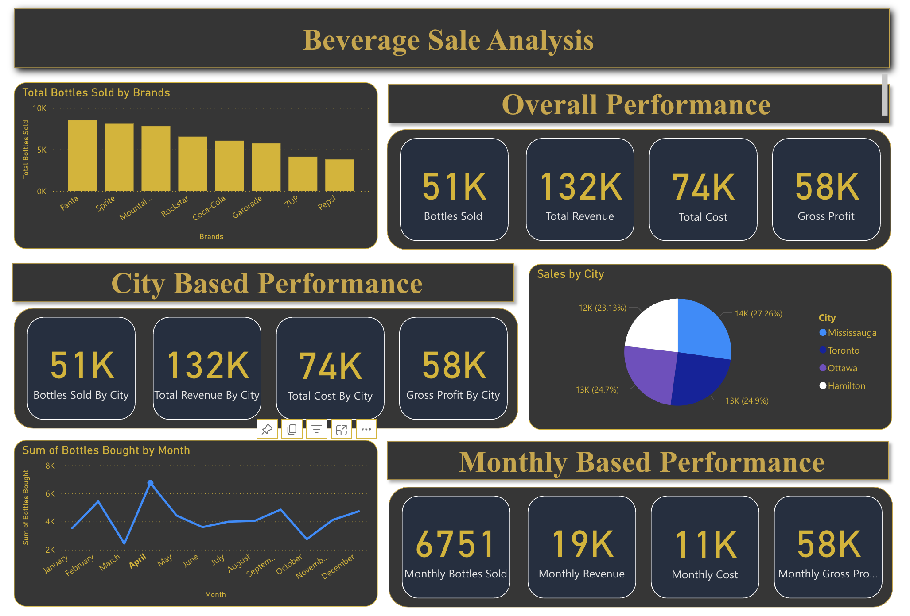

# Beverage-Sale-Analysis

## About
I built an interactive Power BI dashboard for this project to analyze beverage sales data from a CSV file. The goal was to discover key trends across brands, cities, and yearly performance while providing a clear dashboard view of bottles sold, profit, revenue, and cost per category.T he interactive dashboard makes it easy to filter and examine data dynamically. For instance, users can track how different brands perform against each other, like, sales, and break down cost and profit at a glance. Every chart updates instantly, making it easy to analyze the given data. 

